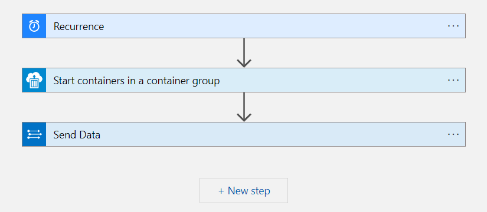

# Manage-DomainMonitorContainer

A playbook that starts the Domain Monitor container once per day. This playbook will send a status event to the DomainMonitor_CL table.

## Deploy to Azure

## Screenshot

