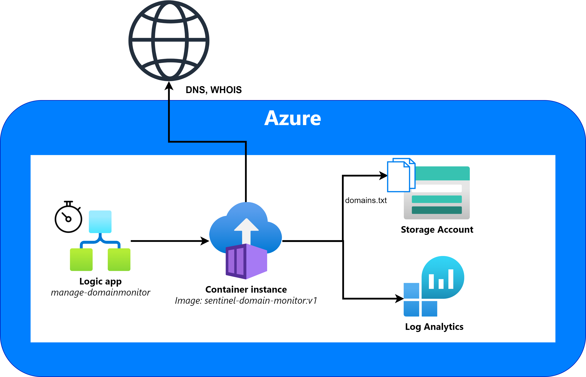
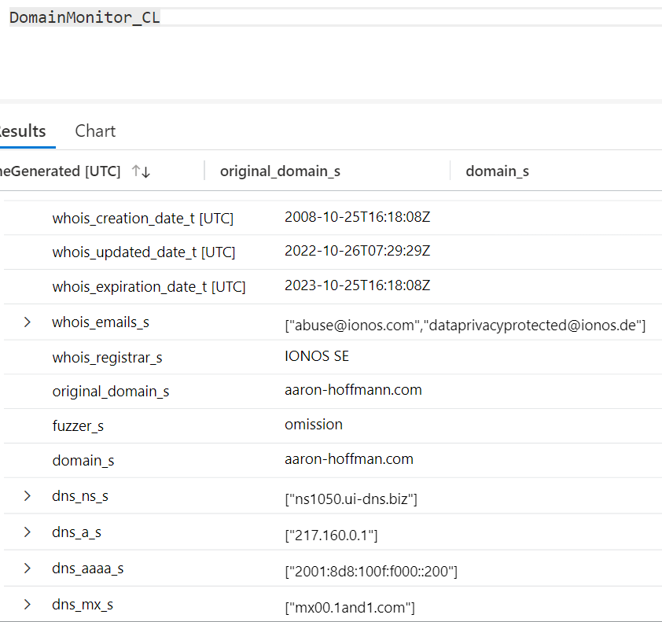
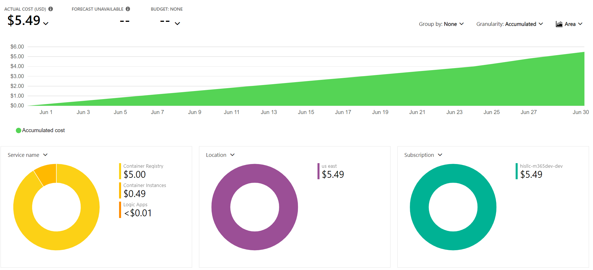

# MicrosoftSentinel-DomainMonitor
Simple python program that takes a list of domains and uses [dnstwist](https://github.com/elceef/dnstwist) to check for active lookalikes with WHOIS enrichment. Designed to be used with Azure Log Analytics and Microsoft Sentinel.

## Table of Contents

* [Run with Azure Containers](#run-with-azure-containers)
* [Run locally](#run-locally)
* [Deploy to Azure](#deploy-to-azure)

## Sentinel resources
Included in this repository are two Microsoft Sentinel resources to help you get started monitoring domains. Check the README files for each for more info:
- [Playbook Manage-DomainMonitorContainer](./Playbooks/Manage-DomainMonitorContainer/): A playbook that automatically starts the DomainMonitor container once per day
- [Workbook MicrosoftSentinel-DomainMonitor](./Workbooks/MicrosoftSentinel-DomainMonitor/): A workbook that visualizes the data from the DomainMonitor.

# Run with Azure Containers
A Dockerfile has been provided to run this in an Azure Container Instance. 

> **Note**
> Please note that running this in an Azure Container Instance with longer domains is pretty slow. For my website, `aaron-hoffmann.com`, it takes about an hour to complete. For reference, a one or two letter domain only takes a couple mintues, and google.com took about 10 minutes.



For full details on getting started with Azure Container Instances, check out the [official documentation](https://learn.microsoft.com/azure/container-instances/container-instances-quickstart-portal).

## ACI setup - Build the image yourself
1. Create an Azure Container Registry
2. Log in to your registry: `az acr login --name <registry-name>`
3. Clone the repository and cd to the directory: `cd SentinelDomainMonitor/`
4. Build the image: `docker build -t sentinel-domain-monitor .`
5. After the image has been built, tag the image for your container registry: `docker tag sentinel-domain-monitor:v1 <registry-login-server>/sentinel-domain-monitor:v1`
6. Push the image to the registry: `docker push <login-server>/sentinel-domain-monitor:v1`
7. Once the image has been uploaded, create a container instance. You can use the default size of 1 vCPU and 1.5GB memory
8. In the Advanced tab, ensure that you set the required environment variables.
    - WORKSPACE_ID: your log analytics workspace ID
    - SHARED_KEY: your log analytics workspace primary key
    - azure_storage_account: the name of the storage account
    - azure_storage_blob_name: the name of the blob that contains the domains to be monitored
    - azure_storage_container: the name of the blob storage container
9. Wait for the container run to complete, and verify you see events in the DomainMonitor_CL Log Analytics table

## ACI setup - Use my DockerHub image
1. Create a new container instance
2. Under Image Source, select 'Other'
3. Enter the value: `h0ffayyy/sentinel-domain-monitor:v1`
4. Set OS type as Linux
5. You can use the default size of 1 vCPU and 1.5GB memory
6. In the Advanced tab, ensure that you set the required environment variables.
    - WORKSPACE_ID: your log analytics workspace ID
    - SHARED_KEY: your log analytics workspace primary key
    - azure_storage_account: the name of the storage account
    - azure_storage_blob_name: the name of the blob that contains the domains to be monitored
    - azure_storage_container: the name of the blob storage container
7. Wait for the container run to complete, and verify you see events in the DomainMonitor_CL Log Analytics table

## Optional - control container with a Logic App
If you'd like to automatically start the container, an example logic app has been included.
The logic app is set to trigger once a day.

# Run locally

## Requirements
SentinelDomainMonitor requires the following python packages:
```
dnstwist[full]
logger
python-whois
requests
```

See `requirements.txt`

Additionally, your OS must has a package for `whois`.

- Debian/Ubuntu: `sudo apt install whois`

## Installation
To install, download the latest release and unzip the contents.

## Configuration
Place the domains you want to monitor in the `domains.txt` file, one per line.

Set the following environment variables:
    - WORKSPACE_ID: your log analytics workspace ID
    - SHARED_KEY: your log analytics workspace primary key

## Logging
SentinelDomainMonitor write logs locally to `logs/domain_monitor.log` in the container, and to Log Analytics under the table name "DomainMonitor_CL".



# Costs
Costs will vary based on deployed region, total runtime, etc. Running this once per day with an Azure Container Registry, Azure Container instance, and Logic App in East US is roughly $5-6 USD per month:


# Deploy to Azure
Deploy the entire solution, including workbooks and playbooks using the buttons below:

[](https://portal.azure.com/#create/Microsoft.Template/uri/https%3A%2F%2Fraw.githubusercontent.com%2Fh0ffayyy%2FSentinelDomainMonitor%2Fdevelop%2Fazuredeploy.json)
[](https://portal.azure.us/#create/Microsoft.Template/uri/https%3A%2F%2Fraw.githubusercontent.com%2Fh0ffayyy%2FSentinelDomainMonitor%2Fdevelop%2Fazuredeploy.json)