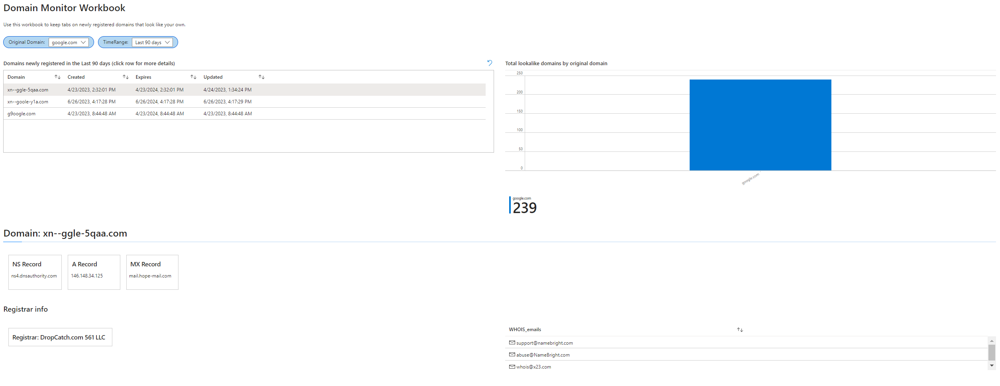

# MicrosoftSentinle-DomainMonitor

A workbook that helps visualize the data from Domain Monitor.

## Deploy to Azure
- Create a new workbook
- Copy and paste the JSON in [MicrosoftSentinel-DomainMonitor.json](./MicrosoftSentinel-DomainMonitor.json)
- Save the workbook

## Screenshots

